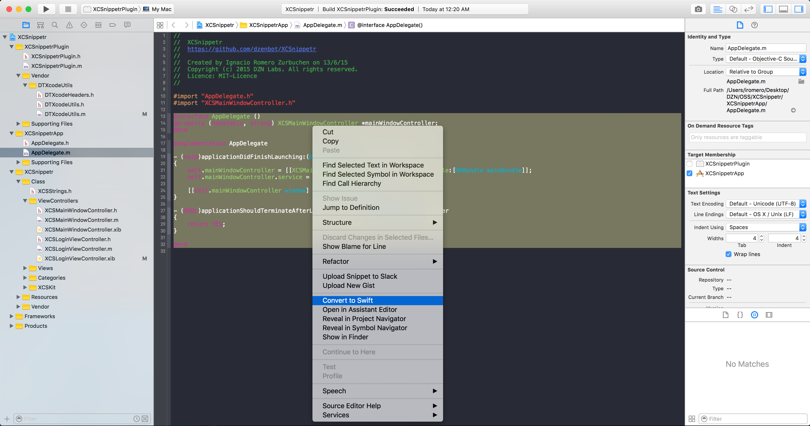
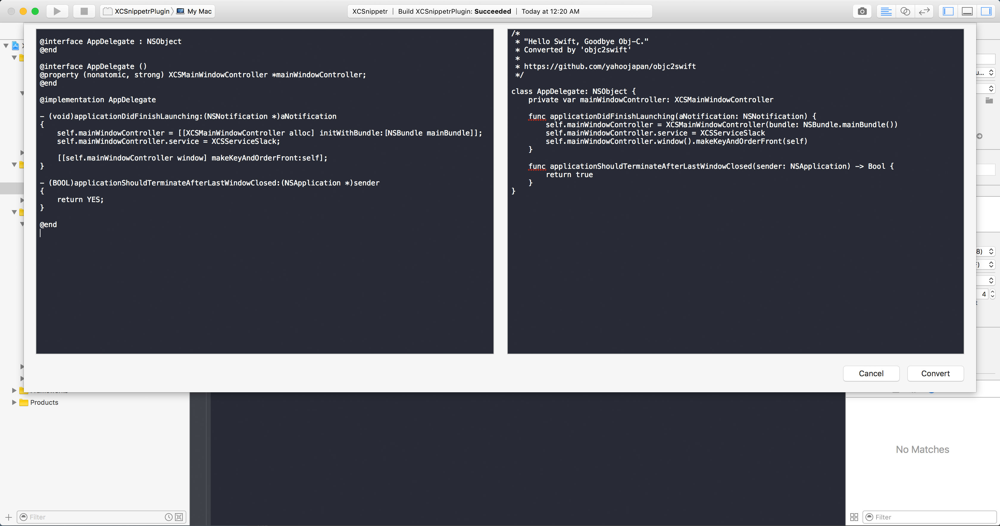

# XCSwiftr

Convert Objective-C code into Swift from within Xcode.
This plugin uses the Java applet of `objc2swift` to do the conversion.

Noticed that the translation is not always accurate? Does it fail at times? Please consider opening an issue in https://github.com/yahoojapan/objc2swift/issues/new.

## Features

- [Powered by Yahoo Japan's objc2swift project](https://github.com/yahoojapan/objc2swift).
- The plugin is available from the code editor's contextual menu.
- Triggers convertion automatically.

## Missing Features

- Language syntax highlight, hopefully with Xcode's current configured theme
- Auto-convert while typing from the left pane
- Set minimum size for each outlet presented in the modal window
- Test coverage

## How to use

Select any Objective-C snippet you would like to convert and right click on it.

A modal window will be presented, with the left pane for Objective-C and the left one, for Swift.

## Install

Install through [Alcatraz](http://alcatraz.io/), the package manager for Xcode.

Alternatively, clone the project:

1. Build the project to install the plugin. The plugin will be installed in `/Library/Application Support/Developer/Shared/Xcode/Plug-ins/XCSwiftr.xcplugin`.

2. Restart Xcode so the plugin bundle is loaded.

## License
(The MIT License)

Copyright (c) 2016 Ignacio Romero Zurbuchen <iromero@dzen.cl>

Permission is hereby granted, free of charge, to any person obtaining a copy of this software and associated documentation files (the 'Software'), to deal in the Software without restriction, including without limitation the rights to use, copy, modify, merge, publish, distribute, sublicense, and/or sell copies of the Software, and to permit persons to whom the Software is furnished to do so, subject to the following conditions:

The above copyright notice and this permission notice shall be included in all copies or substantial portions of the Software.

THE SOFTWARE IS PROVIDED 'AS IS', WITHOUT WARRANTY OF ANY KIND, EXPRESS OR IMPLIED, INCLUDING BUT NOT LIMITED TO THE WARRANTIES OF MERCHANTABILITY, FITNESS FOR A PARTICULAR PURPOSE AND NONINFRINGEMENT. IN NO EVENT SHALL THE AUTHORS OR COPYRIGHT HOLDERS BE LIABLE FOR ANY CLAIM, DAMAGES OR OTHER LIABILITY, WHETHER IN AN ACTION OF CONTRACT, TORT OR OTHERWISE, ARISING FROM, OUT OF OR IN CONNECTION WITH THE SOFTWARE OR THE USE OR OTHER DEALINGS IN THE SOFTWARE.
